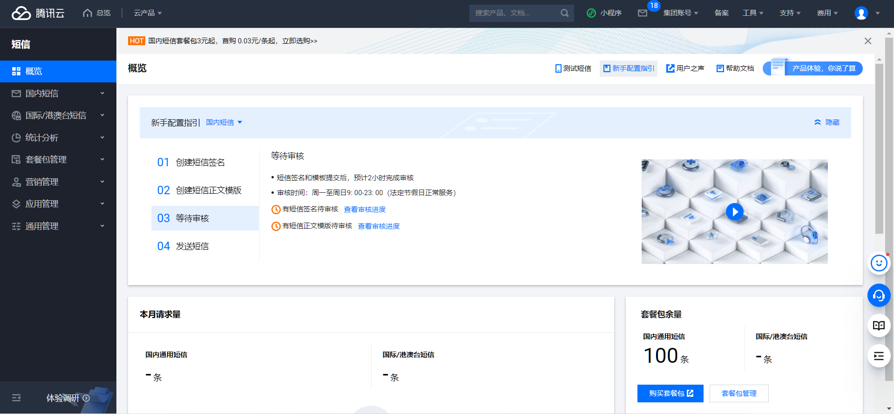
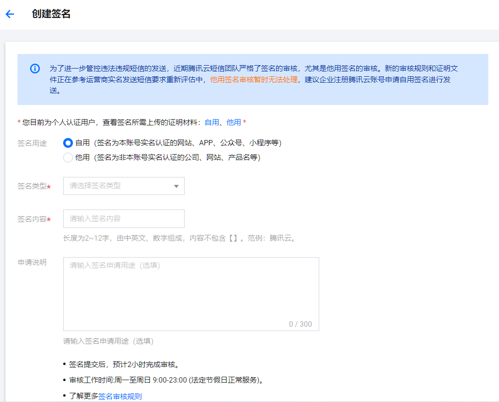

# 腾讯云验证码功能实现


## 1、打开腾讯云短信服务

<br>

搜索框输入短信，可以买一个短信套餐包，便宜不贵,进入短信服务的控制台

<br>




<br>

发送短信有频率限制，企业用户可以修改设置

<br>


<br>

之后我们需要对短信内容进行设置


<br>

## 2、创建短信签名

<br>

&emsp;&emsp;类型有网站、app、公众号、小程序等，如果大家只是想测试一下短信服务的功能，自己创建一个公众号使用最好，其他都需要企业注册等很多要求。

<br>




<br>

&emsp;&emsp;最好自己创建一个微信公众号，类型是公众号，上传公众号设置界面的截图即可，签名必须为公众号名字，申请说明必须填上正当理由，之后等待审核

<br>


<br>

## 3、创建短信正文模板

<br>


输入模板内容，注意短信内容要求，可使用提供的短信内容模板

<br>


<br>

## 4、等待全部审核完毕即可

<br>

签名审核完毕，在之后的api中有一个参数必须写通过审核的签名，才能发送

<br>


<br>

短信内容审核完毕，在之后的api中参数有需要填写 内容ID的，需要我们复制前面的 id

<br>


<br>


## 5、发送短信

<br>

我们使用 API发送短信，下面详细介绍

<br>


<br>

&emsp;&emsp;点击通过 API 发送短信后，这里有接口描述，参数描述，返回信息描述等，有 API 的具体信息点击调试即可，我们会使用 Java SDK 来使用云短信服务，怎么使用呢？ 点击 SDK，进入SDK文档


<br>


<br>

Java SDK 使用短信API说明

https://cloud.tencent.com/document/product/382/43194

按照文档的内容一步一步来即可，如果要使用短信相关的功能，直接复用代码即可

<br>


安装sdk，直接使用 maven 即可

```xml
<dependency>
    <groupId>com.tencentcloudapi</groupId>
    <artifactId>tencentcloud-sdk-java</artifactId>
    <!-- go to https://search.maven.org/search?q=tencentcloud-sdk-java and get the latest version. -->
    <!-- 请到https://search.maven.org/search?q=tencentcloud-sdk-java查询所有版本，最新版本如下 -->
    <version>3.1.571</version>
</dependency>
```

<br>

## 短信业务实战（SpringBoot+Redis）

<br>

&emsp;&emsp;我们提出一个业务要求，要求实现手机验证码注册或者登陆，同时设置验证码的有效期为5分钟，五分钟后失效

<br>


使用SpringBoot创建项目，Redis实现过期的效果

<br>

### 设置配置信息

<br>

```properties
# 应用名称
spring.application.name=demo
# 应用服务 WEB 访问端口
server.port=8080

#配置redis
spring.redis.host=
spring.redis.port=6379
spring.redis.password=
```

<br>

### 使用腾讯云发送短信的API


<br>


（1）设置接口


```java
public interface SendSms { /**
 *
 * @param phoneNum 短信发送的手机号
 * @param templateCode 使用的短信模板id
 * @param code 发送的手机验证码
 * @return 返回是否发送成功
 */
        public boolean send(String phoneNum,String templateCode,String code);
}
```

<br>

（2）设置实现类,所有的信息都在注释里写的非常明确了，也是从腾讯云粘贴下来的，有些信息需要从腾讯云账户获取

<br>


```java
package com.study.service;


import org.springframework.beans.factory.annotation.Autowired;
import org.springframework.beans.factory.annotation.Qualifier;
import org.springframework.data.redis.core.RedisTemplate;
import org.springframework.stereotype.Service;
import com.tencentcloudapi.common.Credential;
import com.tencentcloudapi.common.exception.TencentCloudSDKException;

//导入可选配置类
import com.tencentcloudapi.common.profile.ClientProfile;
import com.tencentcloudapi.common.profile.HttpProfile;

// 导入对应SMS模块的client
import com.tencentcloudapi.sms.v20210111.SmsClient;

// 导入要请求接口对应的request response类
import com.tencentcloudapi.sms.v20210111.models.SendSmsRequest;
import com.tencentcloudapi.sms.v20210111.models.SendSmsResponse;
@Service
public class SendSmsImpl implements SendSms{

     /**
      * @param phoneNum 短信发送的手机号
      * @param templateCode 使用的短信模板id
      * @param code 发送的手机验证码
      * @return 返回是否发送成功
     */

    @Override
    public boolean send(String phoneNum, String templateCode, String code) {

        try {
            /* 必要步骤：
             * 实例化一个认证对象，入参需要传入腾讯云账户密钥对secretId，secretKey。
             * 这里采用的是从环境变量读取的方式，需要在环境变量中先设置这两个值。
             * 你也可以直接在代码中写死密钥对，但是小心不要将代码复制、上传或者分享给他人，
             * 以免泄露密钥对危及你的财产安全。
             * SecretId、SecretKey 查询: https://console.cloud.tencent.com/cam/capi */
            Credential cred = new Credential("secreId", "SecretKey");

            // 实例化一个http选项，可选，没有特殊需求可以跳过
            HttpProfile httpProfile = new HttpProfile();
            // 设置代理（无需要直接忽略）
            // httpProfile.setProxyHost("真实代理ip");
            // httpProfile.setProxyPort(真实代理端口);
            /* SDK默认使用POST方法。
             * 如果你一定要使用GET方法，可以在这里设置。GET方法无法处理一些较大的请求 */
            httpProfile.setReqMethod("POST");
            /* SDK有默认的超时时间，非必要请不要进行调整
             * 如有需要请在代码中查阅以获取最新的默认值 */
            httpProfile.setConnTimeout(60);
            /* 指定接入地域域名，默认就近地域接入域名为 sms.tencentcloudapi.com ，也支持指定地域域名访问，例如广州地域的域名为 sms.ap-guangzhou.tencentcloudapi.com */
            httpProfile.setEndpoint("sms.tencentcloudapi.com");

            /* 非必要步骤:
             * 实例化一个客户端配置对象，可以指定超时时间等配置 */
            ClientProfile clientProfile = new ClientProfile();
            /* SDK默认用TC3-HMAC-SHA256进行签名
             * 非必要请不要修改这个字段 */
            clientProfile.setSignMethod("HmacSHA256");
            clientProfile.setHttpProfile(httpProfile);
            /* 实例化要请求产品(以sms为例)的client对象
             * 第二个参数是地域信息，可以直接填写字符串ap-guangzhou，支持的地域列表参考 https://cloud.tencent.com/document/api/382/52071#.E5.9C.B0.E5.9F.9F.E5.88.97.E8.A1.A8 */
            SmsClient client = new SmsClient(cred, "ap-guangzhou",clientProfile);
            /* 实例化一个请求对象，根据调用的接口和实际情况，可以进一步设置请求参数
             * 你可以直接查询SDK源码确定接口有哪些属性可以设置
             * 属性可能是基本类型，也可能引用了另一个数据结构
             * 推荐使用IDE进行开发，可以方便的跳转查阅各个接口和数据结构的文档说明 */
            SendSmsRequest req = new SendSmsRequest();

            /* 填充请求参数,这里request对象的成员变量即对应接口的入参
             * 你可以通过官网接口文档或跳转到request对象的定义处查看请求参数的定义
             * 基本类型的设置:
             * 帮助链接：
             * 短信控制台: https://console.cloud.tencent.com/smsv2
             * 腾讯云短信小助手: https://cloud.tencent.com/document/product/382/3773#.E6.8A.80.E6.9C.AF.E4.BA.A4.E6.B5.81 */

            /* 短信应用ID: 短信SdkAppId在 [短信控制台] 添加应用后生成的实际SdkAppId，示例如1400006666 */
            // 应用 ID 可前往 [短信控制台](https://console.cloud.tencent.com/smsv2/app-manage) 查看
            String sdkAppId = "XXXXX";
            req.setSmsSdkAppId(sdkAppId);

            /* 短信签名内容: 使用 UTF-8 编码，必须填写已审核通过的签名 */
            // 签名信息可前往 [国内短信](https://console.cloud.tencent.com/smsv2/csms-sign) 或 [国际/港澳台短信](https://console.cloud.tencent.com/smsv2/isms-sign) 的签名管理查看
            String signName = "XXX公众号";
            req.setSignName(signName);

            /* 模板 ID: 必须填写已审核通过的模板 ID */
            // 模板 ID 可前往 [国内短信](https://console.cloud.tencent.com/smsv2/csms-template) 或 [国际/港澳台短信](https://console.cloud.tencent.com/smsv2/isms-template) 的正文模板管理查看
            String templateId = templateCode;
            req.setTemplateId(templateId);

            /* 模板参数: 模板参数的个数需要与 TemplateId 对应模板的变量个数保持一致，若无模板参数，则设置为空 */
            String[] templateParamSet = {code};
            req.setTemplateParamSet(templateParamSet);

            /* 下发手机号码，采用 E.164 标准，+[国家或地区码][手机号]
             * 示例如：+8613711112222， 其中前面有一个+号 ，86为国家码，13711112222为手机号，最多不要超过200个手机号 */
            String[] phoneNumberSet = {"+86"+phoneNum};
            req.setPhoneNumberSet(phoneNumberSet);


            /* 通过 client 对象调用 SendSms 方法发起请求。注意请求方法名与请求对象是对应的
             * 返回的 res 是一个 SendSmsResponse 类的实例，与请求对象对应 */
            SendSmsResponse res = client.SendSms(req);

            // 输出json格式的字符串回包
            System.out.println(SendSmsResponse.toJsonString(res));
            return true;

            // 也可以取出单个值，你可以通过官网接口文档或跳转到response对象的定义处查看返回字段的定义
            // System.out.println(res.getRequestId());

        } catch (TencentCloudSDKException e) {
            e.printStackTrace();
        }
        return false;
    }

}

```

<br>

### 重新配置Redis的序列化

<br>

建一个config包，创建RedisConfig,加上@Config 注解，这些信息也是固定的套路，网上都有


```java
package com.study.config;

import com.fasterxml.jackson.annotation.JsonAutoDetect;
import com.fasterxml.jackson.annotation.PropertyAccessor;
import com.fasterxml.jackson.databind.ObjectMapper;
import org.springframework.beans.factory.annotation.Autowired;
import org.springframework.boot.autoconfigure.condition.ConditionalOnMissingBean;
import org.springframework.context.annotation.Bean;
import org.springframework.context.annotation.Configuration;
import org.springframework.data.redis.connection.RedisConnectionFactory;
import org.springframework.data.redis.core.RedisTemplate;
import org.springframework.data.redis.serializer.Jackson2JsonRedisSerializer;
import org.springframework.data.redis.serializer.StringRedisSerializer;

import java.net.UnknownHostException;

@Configuration
public class RedisConfig {
    //配置我们自己的redisTemplate  固定模板

    @Bean
    @SuppressWarnings("all") //告诉编译器忽略全部的警告，不用在编译完成后出现警告信息
    public RedisTemplate<String, Object> redisTemplate(RedisConnectionFactory factory)
            throws UnknownHostException {

        //我们为了自己开发方便，一般直接使用<String, Object>类型
        RedisTemplate<String, Object> template = new RedisTemplate<String,Object>();
        //连接工厂
        template.setConnectionFactory(factory);

        //Json的序列化配置
        Jackson2JsonRedisSerializer jackson2JsonRedisSerializer = new Jackson2JsonRedisSerializer(Object.class);
        ObjectMapper om = new ObjectMapper(); //JackSon对象
        om.setVisibility(PropertyAccessor.ALL, JsonAutoDetect.Visibility.ANY);
        om.enableDefaultTyping(ObjectMapper.DefaultTyping.NON_FINAL);
        jackson2JsonRedisSerializer.setObjectMapper(om);

        //String类型的序列化配置
        StringRedisSerializer stringRedisSerializer = new StringRedisSerializer();


        //Key采用String的序列化操作
        template.setKeySerializer(stringRedisSerializer);
        //Hash的key也采用String的序列化方式
        template.setHashKeySerializer(stringRedisSerializer);
        //value序列化采用jackson
        template.setValueSerializer(jackson2JsonRedisSerializer);
        //Hash的value序列化也采用jackson
        template.setHashValueSerializer(jackson2JsonRedisSerializer);

        //配置完之后将所有的properties设置进去
        template.afterPropertiesSet();
        return template;
    }
}


```

<br>

### 设置接口，实现验证码的发送

<br>

要实现的业务

（1）生成6位数的随机验证码

（2）对手机号参数进行发送验证码

（3）验证码信息保存到 Redis 数据库中,时效性为5分钟


```java
package com.study.controller;

import com.study.service.SendSmsImpl;

import org.apache.commons.lang3.StringUtils;
import org.springframework.beans.factory.annotation.Autowired;
import org.springframework.data.redis.core.RedisTemplate;
import org.springframework.stereotype.Controller;
import org.springframework.web.bind.annotation.CrossOrigin;
import org.springframework.web.bind.annotation.RequestMapping;
import org.springframework.web.bind.annotation.RequestParam;
import org.springframework.web.bind.annotation.RestController;

import java.util.Random;


@RestController
@CrossOrigin
public class SmsApiController {
    @Autowired
    public SendSmsImpl sendSms;
    @Autowired
    public RedisTemplate<String,Object> redisTemplate;


    public Random random = new Random();

    @RequestMapping("/send")
    public String sendCode(@RequestParam(value = "phone",required = true) String phone) {
        //调用发送的方法即可

        //1、连接Redis，查找手机验证码是否存在
        String code = (String)redisTemplate.opsForValue().get(phone);

        //====================================================
        // 1、1如果存在的话，说明在5分钟内已经发送过验证码了，不能再发了
        if (!StringUtils.isEmpty(code)) {
            System.out.println("已存在，还没有过期，不能再次发送");
            return phone+":"+code+" 已存在，还没有过期";
        }
        //=====================================================

        //1。2 如果不存在的话,那么redis创建键值对生成验证码并存储，设置过期时间
        String newCode = "";
        // 生成6位随机验证码
        for (int i = 0; i < 6; i++) {
            newCode += random.nextInt(10);
        }
        // 将6位随机验证码对手机号进行发送
        boolean idSend = sendSms.send(phone,"XXXXX",newCode);

        //=====================================================

        // 因为有短信轰炸的情况，短信服务对每次发送限制次数，所以有发送不成功的情况，要考虑

        if(idSend){//如果发送成功将验证码存储到redis中
            redisTemplate.opsForValue().set(phone, newCode, 300);
            System.out.println("发送成功!");
            return phone+":"+newCode+" 发送成功!";
        }else{
            System.out.println("发送失败!");
            return "发送失败!";
        }

    }
}

```

<br>

### 效果验证

<br>

第一次传递手机号参数发送验证码短信

<br>


<br>

手机收到腾讯云短信服务发送的短信

<br>


<br>

在5分钟内再次发送短信，此时验证码还未过期所以无法发送

<br>


<br>

5分钟之后再次查看redis客户端发现 验证码在5分钟后已经过期

<br>


